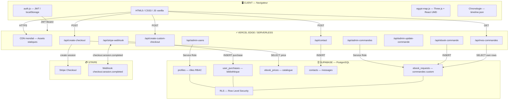

# Kemet — Média indépendant sur l'Égypte ancienne

**Application web fullstack déployée en production.**  
URL : **https://bdd-momo.vercel.app**

> « Comprendre l'Égypte, pas la consommer. »

[](https://github.com/f3n999/kemet/actions/workflows/ci.yml)

---

## Présentation du projet

Kemet est un média de vulgarisation haut de gamme sur l'Égypte ancienne, conçu pour un lecteur exigeant — quelqu'un qui a déjà lu des livres d'histoire et veut du contenu rigoureux, sourcé et sans jargon inutile.

**Problème résolu** : aucun média francophone ne parle sérieusement d'égyptologie à un adulte cultivé. Les sites existants font du "Top 10 des mystères" ou du contenu généré à la chaîne.

**Modèle** : contenu éditorial gratuit + ebooks premium achetables.

**Public cible** : Antoine, 38 ans, ingénieur à Lyon, a lu Grimal et regarde Arte.

---

## Spécifications fonctionnelles

### Personas

| Persona | Description |
|---------|-------------|
| **Antoine** | Lecteur passionné, 38 ans, cherche du contenu rigoureux sans jargon |
| **Admin** | Éditeur/gérant du site, gère les ebooks, les commandes et les utilisateurs |

### Cas d'usage (User Stories)

#### Visiteur non connecté
- En tant que **visiteur**, je veux **parcourir les articles et la chronologie** sans créer de compte, afin d'**évaluer la qualité éditoriale** avant de m'inscrire.
- En tant que **visiteur**, je veux **voir la carte 3D interactive de l'Égypte** et cliquer sur les villes pour lire leur histoire.
- En tant que **visiteur**, je veux **voir le catalogue d'ebooks** (titre, description, prix) pour décider si ça vaut l'achat.
- En tant que **visiteur**, je veux **m'inscrire avec email/mot de passe** pour accéder aux fonctionnalités membres.

#### Utilisateur connecté
- En tant qu'**utilisateur**, je veux **acheter un ebook via Stripe** et le retrouver instantanément dans mon dashboard.
- En tant qu'**utilisateur**, je veux **commander un ebook sur-mesure** (thème au choix), recevoir un devis de l'admin, puis payer.
- En tant qu'**utilisateur**, je veux **accéder à ma bibliothèque personnelle** et télécharger les ebooks que j'ai achetés.
- En tant qu'**utilisateur**, je veux **contacter l'équipe** via un formulaire, avec confirmation que mon message a bien été reçu.

#### Admin
- En tant qu'**admin**, je veux **voir la liste de tous les utilisateurs** et gérer leurs accès aux ebooks.
- En tant qu'**admin**, je veux **consulter toutes les commandes sur-mesure**, fixer le prix, et marquer comme livré.
- En tant qu'**admin**, je veux **modifier les prix des ebooks** du catalogue directement depuis le panel.

### Périmètre MVP (In scope / Out of scope)

| In scope ✅ | Out of scope ❌ |
|------------|----------------|
| Auth email/mot de passe | Auth OAuth (Google, GitHub) |
| Achat ebook catalogue | Abonnement récurrent |
| Commande ebook sur-mesure | Blog avec éditeur intégré |
| Dashboard utilisateur | Commentaires / forum |
| Panel admin CRUD | Analytics avancés |
| Carte 3D interactive | Carte modifiable par l'admin |
| Chronologie filtrée JSON | CMS headless |

### Parcours utilisateur principal — Achat d'ebook

```
1. Visiteur arrive sur index.html
       ↓
2. Clique sur "Ebooks" dans la nav
       ↓
3. Parcourt le catalogue (ebooks.html)
       ↓
4. Clique "Acheter" → redirigé vers login.html si non connecté
       ↓
5. Connexion (ou inscription → login)
       ↓
6. Retour sur ebooks.html → clique "Acheter" à nouveau
       ↓
7. POST /api/create-checkout → session Stripe créée
       ↓
8. Redirection vers Stripe Checkout (page Stripe externe)
       ↓
9. Paiement confirmé → Stripe envoie webhook → POST /api/stripe-webhook
       ↓
10. Webhook : enregistrement dans user_purchases (Supabase)
       ↓
11. Redirection vers checkout-success.html
       ↓
12. Utilisateur accède à dashboard.html → ebook téléchargeable
```

---

## Architecture (3 tiers)

### Schéma Mermaid



### ASCII (résumé 3 tiers)

```
┌─────────────────────────────────────┐
│           CLIENT (Navigateur)        │
│  HTML/CSS/JS · Three.js · React UMD │
│  Auth dual-mode (localStorage/Supa) │
└──────────────┬──────────────────────┘
               │ HTTPS
┌──────────────▼──────────────────────┐
│         VERCEL EDGE / SERVERLESS     │
│  CDN mondial · TLS automatique       │
│  /api/contact          (Node.js)     │
│  /api/create-checkout  (Stripe)      │
│  /api/stripe-webhook   (webhook)     │
│  /api/admin-users      (protégé)     │
│  + 5 autres endpoints                │
└──────────────┬──────────────────────┘
               │ REST + JWT
┌──────────────▼──────────────────────┐
│           SUPABASE                   │
│  PostgreSQL · Auth · RLS             │
│  Tables : profiles, user_purchases,  │
│  ebook_prices, contacts,             │
│  ebook_requests                      │
└─────────────────────────────────────┘
```

---

## Stack technique

| Couche | Technologie | Justification |
|--------|-------------|---------------|
| **Frontend** | HTML5 / CSS3 / JavaScript vanilla | Site majoritairement statique — React aurait ajouté de la complexité inutile pour du contenu. Le HTML est l'outil adapté. |
| **Base de données** | Supabase (PostgreSQL managé) | Même moteur SQL qu'un serveur PostgreSQL classique, avec auth, RLS et API REST intégrés. Zero infrastructure à gérer. |
| **Backend / API** | Vercel Serverless Functions (Node.js) | Les endpoints vivent dans `/api/` et sont déployés automatiquement avec le reste du site. Pas de serveur à maintenir. |
| **Paiements** | Stripe Checkout | Solution éprouvée, PCI-DSS compliant. Le backend valide chaque session avant de livrer l'ebook. |
| **Déploiement** | Vercel (CDN mondial + CI/CD) | Un `git push` déclenche un build et un déploiement automatique. HTTPS géré, edge network mondial. |
| **Visualisation 3D** | Three.js (ES modules via CDN) | Carte interactive 3D de l'Égypte avec OrbitControls, géométries extrudées, Nile animé, pyramides 3D. |
| **Qualité** | ESLint + GitHub Actions | Lint automatique sur chaque PR + scan secrets Gitleaks. |

---

## Aperçu de l'application

> 🌐 **Application en production : [https://bdd-momo.vercel.app](https://bdd-momo.vercel.app)**

| Page | URL directe |
|------|-------------|
| Accueil + carte 3D | [bdd-momo.vercel.app](https://bdd-momo.vercel.app) |
| Chronologie interactive | [/chronologie.html](https://bdd-momo.vercel.app/chronologie.html) |
| Catalogue ebooks | [/ebooks.html](https://bdd-momo.vercel.app/ebooks.html) |
| Dashboard utilisateur | [/dashboard.html](https://bdd-momo.vercel.app/dashboard.html) |
| Panel admin | [/admin.html](https://bdd-momo.vercel.app/admin.html) |

---

## Fonctionnalités

- **13 pages HTML** : index, histoire, chronologie, pharaons, théorie, ebooks, commande, contact, login, register, dashboard, admin, checkout-success
- **Authentification complète** : inscription, connexion, sessions JWT (Supabase) avec fallback localStorage (mode démo)
- **RBAC** : rôles `admin` / `user` appliqués côté client ET côté serveur (RLS PostgreSQL)
- **Achat d'ebooks** : flow Stripe Checkout complet — paiement → webhook → livraison → dashboard
- **Commandes sur-mesure** : formulaire de demande → admin fixe le prix → client paie → ebook livré
- **Dashboard utilisateur** : bibliothèque des ebooks achetés, historique commandes
- **Panel admin** : gestion utilisateurs, accès ebooks, prix, commandes
- **Carte 3D interactive** : Three.js, 8 villes cliquables, Nil animé, pyramides 3D, labels géographiques
- **Chronologie interactive** : 32+ événements filtrables par période et mot-clé
- **API serverless** : 9 endpoints Vercel avec validation serveur, gestion d'erreurs HTTP correcte
- **Security headers** : CSP, HSTS (2 ans), X-Frame-Options DENY, X-Content-Type-Options nosniff

---

## Sécurité

| Mesure | Implémentation |
|--------|---------------|
| Mots de passe | Hashés par Supabase Auth (bcrypt interne) |
| Sessions | JWT Supabase, expiration automatique |
| Autorisation API | Chaque endpoint vérifie le rôle / l'email avant d'agir |
| RLS PostgreSQL | Chaque user ne voit que ses propres données |
| Secrets | Variables d'environnement Vercel, absents du repo |
| Headers HTTP | CSP, HSTS, X-Frame-Options, X-Content-Type-Options |
| Anti-IDOR | Vérification email côté serveur sur chaque opération sensible |
| Scan secrets | Gitleaks via GitHub Actions sur chaque push |

---

## Structure du projet

```
.
├── index.html              → Accueil + carte 3D
├── histoire.html           → Récit chronologique long
├── chronologie.html        → Frise interactive
├── pharaons.html           → Galerie des figures
├── ebooks.html             → Catalogue ebooks
├── commande.html           → Commande sur-mesure
├── dashboard.html          → Espace utilisateur
├── admin.html              → Panel admin (accès restreint)
├── login.html / register.html
├── contact.html
├── api/
│   ├── contact.js          → Formulaire de contact → Supabase
│   ├── create-checkout.js  → Session Stripe ebook catalogue
│   ├── create-custom-checkout.js → Session Stripe commande sur-mesure
│   ├── stripe-webhook.js   → Livraison ebook après paiement
│   ├── admin-users.js      → Liste utilisateurs (service role, protégé)
│   ├── admin-commandes.js  → Liste commandes admin
│   ├── admin-update-commande.js → Mise à jour statut commande
│   ├── ebook-commande.js   → Création commande sur-mesure
│   └── mes-commandes.js    → Commandes de l'utilisateur connecté
├── assets/
│   ├── css/style.css       → Design system complet (variables CSS)
│   ├── css/egypt-map.css   → Styles carte 3D
│   ├── js/main.js          → Navigation, chronologie, formulaire
│   ├── js/auth.js          → Authentification dual-mode
│   ├── js/components.js    → Header/footer partagés
│   ├── js/kemet-config.js  → Configuration Supabase
│   └── js/egypt-map.js     → Carte 3D Three.js + React
├── data/
│   └── timeline.json       → 32+ événements de la chronologie
├── ebooks/                 → Fichiers PDF des ebooks
├── .github/
│   └── workflows/
│       └── ci.yml          → CI : lint + scan secrets + build Vercel
├── eslint.config.js        → Configuration ESLint (API + assets/js)
├── vercel.json             → Headers sécurité + config déploiement
└── package.json            → Dépendances (Stripe, ESLint)
```

---

## Base de données (Supabase / PostgreSQL)

```sql
-- Profils utilisateurs (extension de auth.users)
public.profiles        (id uuid PK → auth.users, name text, role text CHECK IN ('user','admin'))

-- Achats ebooks
public.user_purchases  (id uuid PK, user_id → auth.users, ebook_slug text, purchased_at, stripe_session)

-- Prix catalogue
public.ebook_prices    (slug text PK, price numeric, updated_at)

-- Contacts
public.contacts        (id uuid PK, prenom, email, sujet, message, created_at)

-- Commandes sur-mesure
public.ebook_requests  (id uuid PK, user_id → auth.users, email, sujet, status, price, delivery_url, ...)
```

**RLS (Row Level Security)** activé sur toutes les tables publiques :
- Un `user` ne lit que ses propres lignes
- Un `admin` accède à tout via le service role (côté serveur uniquement)

---

## Variables d'environnement

À configurer dans Vercel (ou dans un fichier `.env.local` pour le développement local avec Vercel CLI) :

```env
SUPABASE_URL=https://xxxx.supabase.co
SUPABASE_ANON_KEY=eyJ...
SUPABASE_SERVICE_ROLE_KEY=eyJ...
STRIPE_SECRET_KEY=sk_live_...
STRIPE_WEBHOOK_SECRET=whsec_...
BASE_URL=https://bdd-momo.vercel.app
ADMIN_EMAIL=votre@email.com
```

> ⚠️ **Aucune de ces valeurs n'est dans le repo.** Vérifiable avec `git log -p | grep -i "sk_live\|service_role\|whsec"`.

---

## Compte de démonstration

| Rôle | Email | Mot de passe |
|------|-------|-------------|
| **Utilisateur** | `demo@kemet.fr` | `Kemet2025!` |
| **Admin** | Demander à l'auteur | — |

Le compte démo dispose de 2 ebooks déjà achetés dans la bibliothèque (tableau de bord démontrable immédiatement).

---

## Lancer en local

Les fonctions serverless nécessitent Vercel CLI pour tourner localement :

```bash
# Installer Vercel CLI (une seule fois)
npm i -g vercel

# Cloner et configurer
git clone https://github.com/f3n999/kemet.git
cd kemet

# Installer les dépendances (ESLint, Stripe)
npm install

# Lier au projet Vercel (récupère les env vars automatiquement)
vercel link
vercel env pull .env.local

# Lancer en local avec les fonctions serverless actives
vercel dev
```

> Sans `vercel dev`, les pages statiques fonctionnent via `npx serve .` ou `python3 -m http.server 8000`, mais les API (`/api/*`) ne seront pas disponibles.

---

## Git Flow

Ce projet suit un **Git Flow simplifié** :

```
main ──────────────────────────────────────────────── (production)
  │                        ↑ PR + review
dev ────────────────────────────────────────────────── (intégration)
  │          ↑ merge       ↑ merge
  ├── feature/stripe-payments
  ├── feature/ebook-sur-mesure
  └── feature/commandes-flow
```

### Règles de branches

| Branche | Rôle | Protection |
|---------|------|------------|
| `main` | Production — chaque commit = déploiement Vercel | ✅ Branch protection, PRs obligatoires |
| `dev` | Intégration — base de toutes les features | ✅ Branch protection, PRs obligatoires |
| `feature/*` | Développement d'une fonctionnalité | Créée depuis `dev`, mergée via PR |

### Convention de commits (Conventional Commits)

```
feat(auth): add JWT refresh token rotation
fix(stripe): handle webhook signature verification edge case
docs(readme): add Mermaid architecture diagram
chore(ci): add Gitleaks secret scanning workflow
refactor(api): extract validation middleware
test(checkout): add unit tests for price calculation
```

---

## CI/CD

### Pipeline complet

```
git push origin feature/ma-feature
       ↓
GitHub Actions CI (lint + scan secrets + build check)
       ↓ si ✅
Pull Request vers dev → review
       ↓ si approved
Merge sur dev
       ↓
Pull Request dev → main → review finale
       ↓ si approved
Merge sur main
       ↓
GitHub webhook → Vercel
       ↓
Build automatique (< 30s)
       ↓
Déploiement production
```

### Détail du workflow GitHub Actions (`.github/workflows/ci.yml`)

| Job | Ce qu'il fait | Se déclenche sur |
|-----|--------------|-----------------|
| `security` | Scan Gitleaks — détecte clés/secrets commités | Push + PR |
| `lint` | ESLint sur `api/**` et `assets/js/**` + validation JSON | Push + PR |
| `build` | `vercel build` — vérifie que le projet compile | Push + PR (après lint) |

---

## Checklist sécurité OWASP (appliquée)

- [x] **A01 Broken Access Control** — RLS PostgreSQL + vérification serveur sur chaque endpoint
- [x] **A02 Cryptographic Failures** — HTTPS forcé (HSTS 2 ans), mots de passe jamais stockés en clair
- [x] **A03 Injection** — Requêtes Supabase paramétrées (SDK), pas de SQL concaténé
- [x] **A05 Security Misconfiguration** — CSP stricte, X-Frame-Options DENY, secrets en env vars
- [x] **A07 Auth Failures** — Sessions JWT Supabase, expiration automatique, pas de secrets côté client

---

## Auteur

Mohamed El Naggar — Bachelor 3 Cybersécurité, Oteria 2025-2026  
Cours : Infrastructure et Programmation Web — Florian Amette
